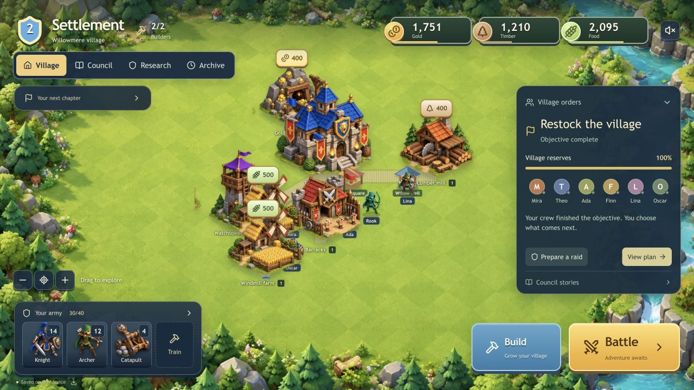
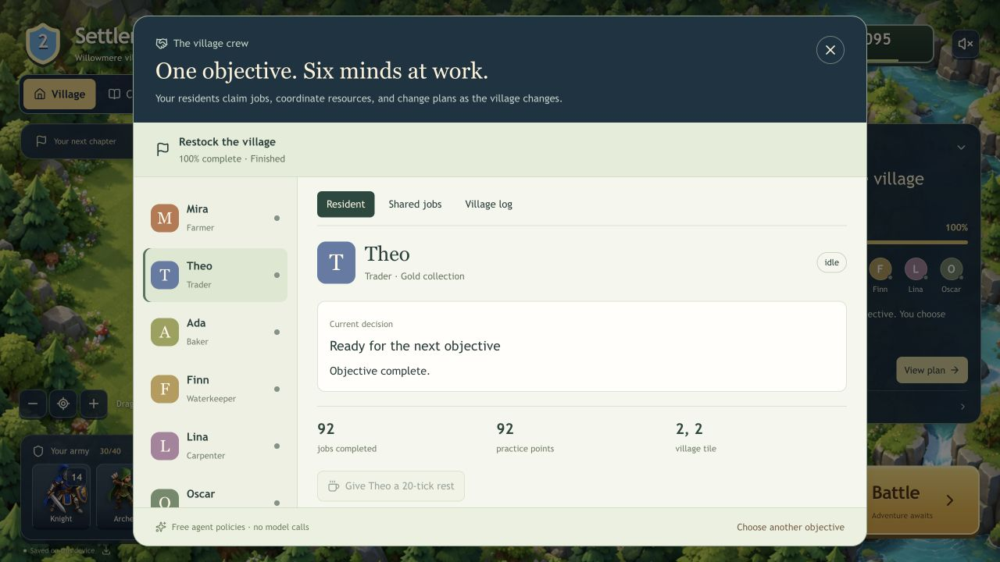
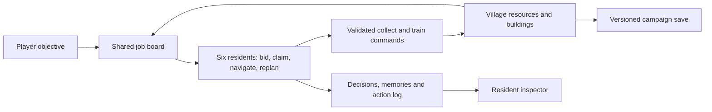

<div align="center">

# Settlement

### Set the objective. Let the village figure out the work.

A multi-agent village strategy game and an inspectable AI simulation lab.

[](https://github.com/Lingikaushikreddy/Settlement-Village/actions/workflows/ci.yml)
[](LICENSE)
[](https://www.typescriptlang.org/)
[](#run-locally)

[Quick start](#run-locally) · [How agents work](#how-the-agents-work) · [Player guide](docs/player-guide.md) · [Contribute](CONTRIBUTING.md)



</div>

**Give six residents a shared goal—prepare for a raid or restock the village—and watch them claim jobs, navigate to workplaces, gather resources, and coordinate recruitment.** Inspect what each resident is doing, why they took the job, and what they remember. Then command your army in battle, or open the research desk to investigate social decisions and replay their evidence.

The default game runs locally with **no API key, paid AI, account, or database required**. Campaign residents use deterministic game AI. Optional Claude decisions are available for explicit steps in local-worker research experiments.

If you like games where agent decisions are visible, **star the repository** to follow Settlement's development.

## Try this first

1. Choose **Village orders → Prepare for a raid**. Review the recruitment budget.
2. Watch residents divide collection and recruitment jobs. Their actions change your real treasury and army.
3. Open **View plan → Shared jobs**, then inspect a resident's decision and memories.
4. Give a working resident a **20-tick rest**. Another available resident can take over.
5. Once 30 troops and the required reserves are ready, choose **Scout a raid** and lead the attack.

Prefer a peaceful village? Choose **Restock supplies**. Prefer experiments? Open **Research** and compare how different policies respond to the same claims.

## What you can play today

| System                    | What it does                                                                                                                                 |
| ------------------------- | -------------------------------------------------------------------------------------------------------------------------------------------- |
| **Cooperating residents** | Six agents bid for exclusive jobs using role suitability, distance and bounded experience. They replan when workplaces or resources change.  |
| **Village building**      | Place, move and upgrade six building types. Manage two builders, production, storage and your treasury.                                      |
| **Troops and battles**    | Recruit knights, archers and catapults. Deploy and focus attacks across three enemy strongholds.                                             |
| **Inspectable decisions** | Read current jobs, blocked work, spending limits, recent memories and the village action log.                                                |
| **Council stories**       | Investigate four authored social chapters, inspect claims and evidence, and intervene with real treasury consequences.                       |
| **Research and replay**   | Run seeded experiments, compare policies, inspect historical evidence, export runs and verify deterministic replay.                          |
| **Optional live models**  | Ask Claude to propose a social action in a configured local-worker experiment, with validated actions, usage records and spend reservations. |
| **Save continuity**       | Browser-local campaign saves, portable JSON exports and an optional SQLite worker for durable research runs.                                 |



_Screenshots show the running game. Residents currently reuse the character sprite atlas with distinct names and labels._

## Run locally

Use **Node.js 24+** and npm. The optional `.nvmrc` selects Node 24.

```bash
git clone https://github.com/Lingikaushikreddy/Settlement-Village.git
cd Settlement-Village
npm ci
npm run dev
```

Open **http://localhost:5173**. Your village saves in that browser. Keep one active game tab per origin and export valuable saves from the village guide.

To include the optional local research worker:

```bash
npm run dev:all
```

The worker listens on `127.0.0.1:8787` and stores research runs in `work/settlement.sqlite`. No model key is needed. For explicit paid model steps, follow [Live model setup](docs/live-models.md); provider calls stay disabled until configured.

To preview a production build locally:

```bash
npm run build
npm start -- --port 5173
```

This repository contains the full local application. A public repository is not a hosted game server; deployment requires a compatible runtime. The optional research worker is designed for local use.

## How the agents work



**World layer:** buildings produce resources, the treasury pays for recruitment, and training produces actual troops. Agents use the same commands as the player's manual controls.

**Behavior layer:** the planner decomposes one shared objective into useful jobs. Each job has one owner. Residents follow walkable grid routes, release work when resting, and reconsider blocked or obsolete tasks.

**Tools and records:** actions validate current funds, capacity and the objective's spending allowance. Saved state preserves claims, positions, spending and recent memories. Loading pauses decisions until you resume.

Crew work pauses offline, during raids, and when entering Council or Research. Production and existing training timers continue. Research worlds are separate from campaign currency; their evidence and replay tools share the same application.

See [Objective agents](docs/objective-agents.md) for exact rules and boundaries.

## Stack and project map

**TypeScript · React · Next-compatible routing with vinext/Vite · Zod · Tailwind CSS · optional Node.js/SQLite worker**

```text
app/                 Application entry points
components/game/     Village, combat, crew inspector and research views
lib/game/            Pure campaign, crew, economy and battle transitions
lib/sim/             Deterministic social engine and bounded planner
lib/agent/           Optional Claude proposals and action validation
worker/              Local persistence, scheduling and model request ledger
tests/               Engine, game, crew, replay and worker tests
public/game/         Original generated terrain and sprite artwork
docs/                Guides, design notes and verification records
```

## Verification

```bash
npm test
npm run test:integration
npm run typecheck
npm run lint
npm run build
```

The v0.1.0 gameplay verification includes **78 passing tests plus the HTTP integration flow**, with desktop and phone browser checks. CI runs these checks on pushes and pull requests. Tests cover resource conservation, duplicate spending, job claims and handoffs, inaccessible workplaces, save validation, deterministic replay and worker recovery. See [verification notes](docs/objective-agents-verification.md).

Model tests use injected provider responses. A live paid provider was not called during development.

## Current scope and next steps

This is a playable single-player foundation for an agent-driven game. Campaign AI is rule-based: it does not train a neural network or understand arbitrary natural-language objectives. Council scenarios are authored. Multiplayer, autonomous construction, agent-led combat and model-controlled campaign play are not implemented.

Areas for future contributions:

- [ ] Richer objectives, dependencies and recovery behavior
- [ ] Distinct civilian art and activity animations
- [ ] Persistent relationships across social chapters
- [ ] More adversarial and honest-control research scenarios
- [ ] Carefully bounded model-assisted campaign planning

The [contribution guide](CONTRIBUTING.md) explains setup, useful starting points and how to validate a change. Bug reports with a reproducible save and screenshots are especially helpful.

## Guides

- [Player guide](docs/player-guide.md) — building, battles, objectives and Council stories
- [Objective agents](docs/objective-agents.md) — assignment, pathfinding, budgets and adaptation
- [Research guide](docs/observatory-guide.md) — experiments, evidence, comparisons and replay
- [Live model setup](docs/live-models.md) — optional Claude configuration and usage controls
- [Security policy](SECURITY.md) — local runtime boundaries and vulnerability reporting

## License and credits

Created by **Kaushik Reddy**. Released under the [MIT License](LICENSE).

Terrain and sprites are original AI-generated artwork created for Settlement. No franchise assets were extracted. Existing third-party license notices remain with their source files; see [Third-party notices](THIRD_PARTY_NOTICES.md).

The social simulation is inspired by [Generative Agents](https://arxiv.org/abs/2304.03442) and [AI Town](https://github.com/a16z-infra/ai-town). Settlement implements its own bounded gameplay and research loops; it is not affiliated with those projects.
