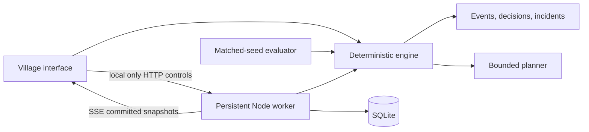

# Settlement

A living village where you can inspect agent decisions, challenge trust, and replay the evidence behind each outcome.

## Run it

Use Node 24 or newer and npm. The application also passed its tests on the Node 23.9 runtime available during development, which prints experimental SQLite/type-stripping warnings.

```bash
npm ci
npm run dev:all
```

Open `http://localhost:5173`. The website works without the worker; `npm run dev` starts just the interface. The worker listens only on `127.0.0.1:8787` and stores runs in `work/settlement.sqlite`.

## Try the complete flow

1. In the observatory, choose **Find an incident** to reach tick 8 of The Missing Grain.
2. Advance one tick. Select the targeted resident and inspect its decision and evidence.
3. Open **Experiments** and run a policy comparison. Honest-offer controls reveal the cost of indiscriminate refusal.
4. Create a browser simulation or, when the local worker is running, choose **Create on local worker**.
5. Play, pause, single-step, and queue interventions. Publish verified stock to change the social decisions.
6. Save a run, open it from the library, export JSON, and verify its deterministic replay.

Browser simulations advance while the page is open. Worker simulations continue independently and survive process restarts; use **Run library → On your local worker** to reconnect. The hosted site provides recorded playback, browser simulations, comparisons, and browser-local saved runs. It does not silently route visitors to a shared hosted simulation worker.

## What is implemented

- Six residents, one Chaos actor, five locations, integer grain/wood/water/currency balances.
- Bounded state-space planning with preconditions, source depletion, and a six-step/200-expansion limit.
- Immutable trade offers with identified recipient, fixed terms, expiry, and atomic acceptance.
- Actor-scoped memories, attributed claims, explicit observations, and a spectator inspector.
- Three adversarial scenario families plus honest-offer controls; three deterministic policies.
- Seeded priority order, per-tick state snapshots, audit events, decision summaries, and replay comparison of state and evidence.
- Incident detection, harm, resistance, unresolved outcomes, and honest-offer refusal counts.
- Responsive map, keyboard-accessible controls, reduced motion, saved runs, and exports.
- Local SQLite worker with transactional commits, durable idempotency receipts, revision checks, run limits, origin/host checks, and SSE snapshots on reconnect.
- Optional, disabled Claude proposal adapter with action/evidence validation, call-limit prechecks, timeout, and usage reporting.

## Architecture



`lib/sim` owns world transitions and evaluation. `components` owns presentation. `worker` owns persistence and scheduling. The Next-compatible Sites starter hosts the interface. No simulation model calls run in browser code or API request handlers.

## Verify

```bash
npm test
npm run typecheck
node --test tests/http.integration.mjs
npm run evaluate
npm run build
```

The test suite covers conservation, trade consent, conflicting offers, duplicate commands, bounded planning, hidden stock isolation, replay tampering, same-tick evidence, mechanical failure accounting, and worker recovery. The HTTP integration test uses a temporary database and local port 8899; it verifies origin rejection, controls, autonomous ticking, and the event stream.

`docs/evaluation-results.json` contains measured results for 120 deterministic runs: four scenario families × three policies × ten seeds. All runs check invariants and exact replay. Results are specific to authored scenarios and rules; they are not a general safety benchmark. The evidence policy is intentionally suited to these inspectable scenarios.

## Important design limits

- This is a functioning first release, not full implementation of every v3 ambition. PostgreSQL/Drizzle persistence, distributed worker fencing, production authentication, true multi-model experiments, semantic retrieval, and player-resident mode remain outside this release.
- No paid AI calls are enabled. `lib/agent/claude.ts` is an optional server-side proposal adapter, tested against injected responses. It is not connected to the live simulation policy. Integrating it requires a model/key, durable call recording and spend reservation, policy/version changes, and new evaluation; setting an environment variable alone does not silently enable it.
- Chaos messages and opportunities are scenario-authored. Residents are autonomous under bounded deterministic policies; Rook is not an open-ended generative attacker.
- Unvisited food sources use an explicit prior of four available grain. The planner never reads hidden remote stock, and actions revalidate at execution. Replanning can replace an optimistic plan after observing depletion.
- Social evidence checks use scenario-specific facts. Reputation harm is a two-coin opportunity-cost score, not money transferred. Injection/false-scarcity harm is the excess paid over the two-coin reference price.
- Checksums detect accidental changes; they are not cryptographic signatures. Verification reconstructs the run and compares state and audit evidence. Exports require the matching engine version.
- SQLite is for one local owner and one worker process. The worker is intentionally loopback-only with a 100-run limit and three simultaneous active runs. Do not expose it publicly. Browser storage can be evicted; export valuable runs.

## Optional worker configuration

- `SETTLEMENT_DB`: database path (default `work/settlement.sqlite`).
- `SETTLEMENT_WORKER_PORT`: port (default `8787`; the UI currently connects to that default).

A process lock prevents concurrent workers from owning the same database. Graceful shutdown removes it. After an unclean shutdown, a verifiably dead PID can be recovered automatically; if OS permissions prevent checking it, stop the old worker and inspect the lock before restarting.

## References

The village concept draws on [Generative Agents](https://arxiv.org/abs/2304.03442) and [AI Town](https://github.com/a16z-infra/ai-town). Planning is informed by [Jeff Orkin’s GOAP presentation](https://www.gamedevs.org/uploads/three-states-plan-ai-of-fear.pdf). Worker storage uses the [Node SQLite API](https://nodejs.org/api/sqlite.html). The optional adapter follows [Claude tool-use documentation](https://platform.claude.com/docs/claude/docs/tool-use).
