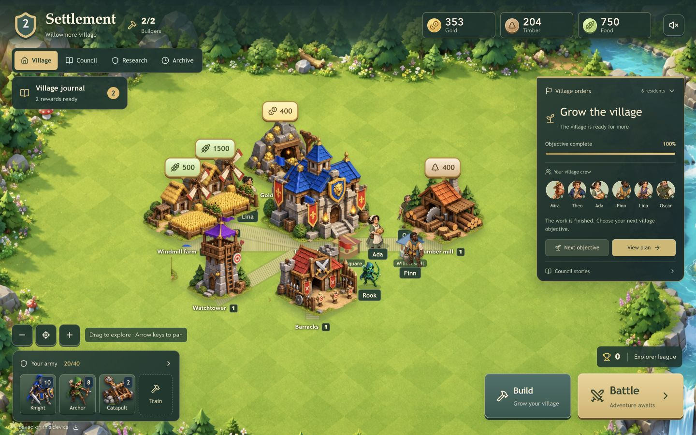
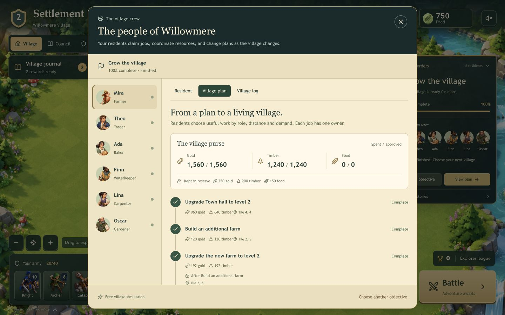
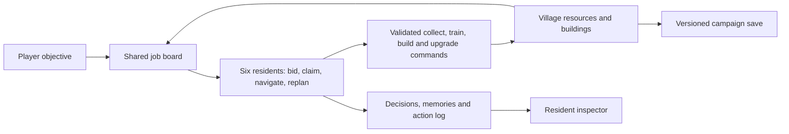

<div align="center">

# Settlement

### Set the objective. Let the village figure out the work.

A multi-agent village strategy game and an inspectable AI simulation lab.

[](https://github.com/Lingikaushikreddy/Settlement-Village/actions/workflows/ci.yml)
[](LICENSE)
[](https://www.typescriptlang.org/)
[](#run-locally)

[Quick start](#run-locally) · [How agents work](#how-the-agents-work) · [Player guide](docs/player-guide.md) · [Contribute](CONTRIBUTING.md)



</div>

**Give six residents a shared goal: grow the village, prepare for a raid, or restock supplies. Watch them claim jobs, gather resources, build and upgrade a new farm, or coordinate recruitment.** Inspect what each resident is doing, why they took the job, and what they remember. Then command your army in battle, or open the research desk to investigate social decisions and replay their evidence.

The default game runs locally with **no API key, paid AI, account, or database required**. Campaign residents use deterministic game AI. Optional Claude decisions are available for explicit steps in local-worker research experiments.

If you like games where agent decisions are visible, **star the repository** to follow Settlement's development.

## Try this first

1. Choose **Village orders → Grow the village**. Review the construction steps, spending ceiling and protected reserves.
2. Select **Start village development**. Residents choose a reachable farm site, collect supplies, schedule builders and complete the required Town hall and farm upgrades.
3. Open **View plan → Village plan** to inspect dependencies, waiting reasons and actual spending. Select a resident to see their decision, route and memories.
4. Give a working resident a **20-tick rest**. Another available resident can take over the job.
5. Open **Village journal** to see production, meet the residents and claim earned milestone rewards.

In a fresh village, the growth plan authorizes at most **1,560 gold and 1,240 timber**, keeping **250 gold, 200 timber and 150 food** in reserve after each crew payment. It finishes with one additional level-three farm and a level-two Town hall. The plan adapts to work you complete manually without paying for it twice.

For an expedition, choose **Prepare for a raid** to ready 30 troops and the village reserves, then lead the attack yourself. **Restock supplies** collects another 300 of each resource without spending. **Research** compares how different policies respond to the same claims.

## What you can play today

| System                           | What it does                                                                                                                                     |
| -------------------------------- | ------------------------------------------------------------------------------------------------------------------------------------------------ |
| **Cooperating residents**        | Six agents bid for exclusive jobs using role suitability, distance and bounded experience. They replan when workplaces or resources change.      |
| **Village development**          | Authorize a frozen construction plan with prerequisites, spending limits and protected reserves. Agents build and upgrade through real commands. |
| **Manual building**              | Place, move and upgrade six building types. See affordability, builder and capacity limits before committing an action.                          |
| **Troops and battles**           | Recruit knights, archers and catapults. Deploy and focus attacks across three enemy strongholds.                                                 |
| **Village journal and identity** | Six illustrated civilian identities across the map and inspectors; milestone rewards, production rates and resident shortcuts in one journal.    |
| **Inspectable decisions**        | Read current jobs, blocked work, spending limits, recent memories and the village action log.                                                    |
| **Council stories**              | Investigate four authored social chapters, inspect claims and evidence, and intervene with real treasury consequences.                           |
| **Research and replay**          | Compare matched seeds, inspect historical evidence, export JSON/CSV reports and independently reproduce every recorded result.                   |
| **Optional live models**         | Ask Claude to propose a social action in a configured local-worker experiment, with validated actions, usage records and spend reservations.     |
| **Save continuity**              | One active campaign tab protects browser-local saves; damaged saves remain available for backup and explicit recovery.                           |



_Screenshots show the running game. Camera controls support pointer and keyboard navigation, and the layout adapts to phones._

## Run locally

Use **Node.js 24+** and npm. The optional `.nvmrc` selects Node 24.

```bash
git clone https://github.com/Lingikaushikreddy/Settlement-Village.git
cd Settlement-Village
npm ci
npm run dev
```

Open **http://localhost:5173**. Your village saves in that browser. A second tab waits until the active village closes; retry there to load the latest save. Export valuable saves from the village guide. Saving requires a browser with Web Locks support on localhost or HTTPS.

To include the optional local research worker:

```bash
npm run dev:all
```

The worker listens on `127.0.0.1:8787` and stores research runs in `work/settlement.sqlite`. No model key is needed. For explicit paid model steps, follow [Live model setup](docs/live-models.md); provider calls stay disabled until configured.

To preview a production build locally:

```bash
npm run build
npm start -- --port 5173
```

This repository contains the full local application. A public repository is not a hosted game server; deployment requires a compatible runtime. The optional research worker is designed for local use.

## How the agents work


```mermaid
flowchart LR
    Player[Player objective] --> Jobs[Shared job board]
    World[Village resources and buildings] --> Jobs
    Jobs --> Crew[Six residents: bid, claim, navigate, replan]
    Crew --> Tools[Validated collect, train, build and upgrade commands]
    Tools --> World
    Crew --> Record[Decisions, memories and action log]
    Record --> Inspector[Resident inspector]
    World --> Save[Versioned campaign save]
```

**World layer:** buildings produce resources, construction occupies builders and finishes on the game clock, and training produces actual troops. Agents use the same commands as the player's manual controls.

**Behavior layer:** the planner decomposes one shared objective into useful jobs. Development freezes a dependency plan and spending ceiling when started. Each job has one owner. Residents follow walkable grid routes, release work when resting, and reconsider blocked or obsolete tasks.

**Tools and records:** actions validate current funds, capacity and the objective's spending allowance. Development payments also preserve the approved reserve floor. Saved state preserves the plan, claims, positions, spending and recent memories. Loading pauses decisions until you resume.

Crew work pauses offline, during raids, and when entering Council or Research. Production and existing training timers continue. Research worlds are separate from campaign currency; their evidence and replay tools share the same application.

See [Objective agents](docs/objective-agents.md) for exact rules and boundaries.

## Reproduce the agent evaluation

Open **Research → Compare** to choose scenarios, matched seeds and run length. Every run must pass conservation checks and exact replay before its results appear. Inspect any included seed, export a compact JSON report or CSV table, and import or paste a report to independently rerun its cases.

The included reference report runs four authored scenarios × three deterministic policies × ten seeds, with **zero model calls**. At 60 ticks, the scarcity scenario produces 36 successful attacks out of 40 evaluated attempts for Trust first, versus 0/40 for Check evidence. Honest controls expose a different cost: Cautious refuses 33/40 honest offers, versus 0/40 for Check evidence. These results describe the authored rules; the evidence policy is deliberately suited to them and they do not measure general AI safety.

```bash
# Independently reproduce the checked-in report; fail on any mismatch
npm run evaluate -- --verify docs/evaluation-results.json

# Generate a fresh reference report
npm run evaluate
```

See [Evaluation reports](docs/evaluation-reports.md) for the format, denominators, limits and measured results.

## Stack and project map

**TypeScript · React · Next-compatible routing with vinext/Vite · Zod · Tailwind CSS · optional Node.js/SQLite worker**

```text
app/                 Application entry points
components/game/     Village, combat, crew inspector and research views
lib/game/            Pure campaign, crew, economy and battle transitions
lib/sim/             Deterministic social engine and bounded planner
lib/agent/           Optional Claude proposals and action validation
worker/              Local persistence, scheduling and model request ledger
tests/               Engine, game, crew, replay and worker tests
public/game/         Original generated terrain and sprite artwork
docs/                Guides, design notes and verification records
```

## Verification

```bash
npm test
npm run test:integration
npm run evaluate -- --verify docs/evaluation-results.json
npm run typecheck
npm run lint
npm run build
```

The suite covers resource conservation, duplicate spending, construction dependencies, manual interference, protected reserves, job claims and handoffs, inaccessible workplaces, save ownership and recovery, report tampering, deterministic replay and worker recovery. CI runs the tests, HTTP integration flow, report reproduction, types, lint and production build on pushes and pull requests. See [release verification](docs/village-v3-verification.md).

Model tests use injected provider responses. A live paid provider was not called during development.

## Current scope and next steps

This is a playable single-player foundation for an agent-driven game. Campaign AI is rule-based: it does not train a neural network or understand arbitrary natural-language objectives. Council scenarios are authored. Agents execute a bounded farm-development plan; arbitrary construction requests, multiplayer, agent-led combat and model-controlled campaign play are not implemented.

Areas for future contributions:

- [ ] More development blueprints and richer campaign objectives
- [ ] Additional civilian activity animations and building art variants
- [ ] Persistent relationships across social chapters
- [ ] More adversarial and honest-control research scenarios
- [ ] Carefully bounded model-assisted campaign planning

The [contribution guide](CONTRIBUTING.md) explains setup, useful starting points and how to validate a change. Bug reports with a reproducible save and screenshots are especially helpful.

## Guides

- [Player guide](docs/player-guide.md) — building, battles, objectives and Council stories
- [Objective agents](docs/objective-agents.md) — assignment, pathfinding, budgets and adaptation
- [Research guide](docs/observatory-guide.md) — experiments, evidence, comparisons and replay
- [Evaluation reports](docs/evaluation-reports.md) — reproducible results and their limits
- [Product roadmap](docs/product-roadmap.md) — priorities and acceptance criteria
- [Live model setup](docs/live-models.md) — optional Claude configuration and usage controls
- [Security policy](SECURITY.md) — local runtime boundaries and vulnerability reporting

## License and credits

Created by **Kaushik Reddy**. Released under the [MIT License](LICENSE).

Terrain, sprites and civilian identities are original AI-generated artwork created for Settlement. See [Art provenance](docs/art-provenance.md). No franchise assets were extracted. Existing third-party license notices remain with their source files; see [Third-party notices](THIRD_PARTY_NOTICES.md).

The social simulation is inspired by [Generative Agents](https://arxiv.org/abs/2304.03442) and [AI Town](https://github.com/a16z-infra/ai-town). Settlement implements its own bounded gameplay and research loops; it is not affiliated with those projects.
